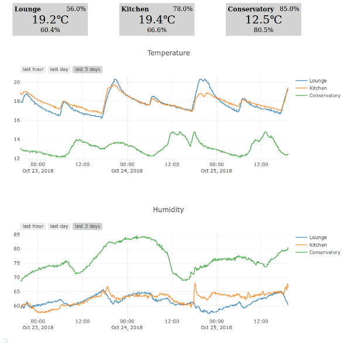

# Weather Station Monitoring

weatherstation is a python app that provides a dashboard showing output from your Raspberry Pi weather station.

It's currently really basic, so only provides temperature readouts.



## Setup

weatherstation is written using python and dash, but if you have docker installed you don't need to worry about that.

You'll need to ensure your weather station is providing temperatures via a log in the format:

```
2018-06-03T14:45:35	21.312
2018-06-03T14:47:57	21.312
2018-06-03T14:50:19	21.375
2018-06-03T14:52:41	21.312
2018-06-03T14:55:03	21.312
2018-06-03T14:57:25	21.312
2018-06-03T14:59:48	21.375
```
This is a UTC datetime and a temperature in degrees celsius, with tab separation.

Make a note of the URL for this log file.

To start the dashboard, run:
docker run --name weather -d -p 5000:5000 -e TEMP_URL='{MY LOGFILE URL}' lucyb/weatherstation

Then access the dashboard in a browser, using the address http://localhost:5000

## Building it yourself

To build your own docker image, checkout this code and run:
```
docker build . -t weatherstation
```

To run it without docker:
```
TEMP_URL='{MY LOGFILE URL}'
cd app
pip3 -r requirements.txt
cd web
python app.py
```
